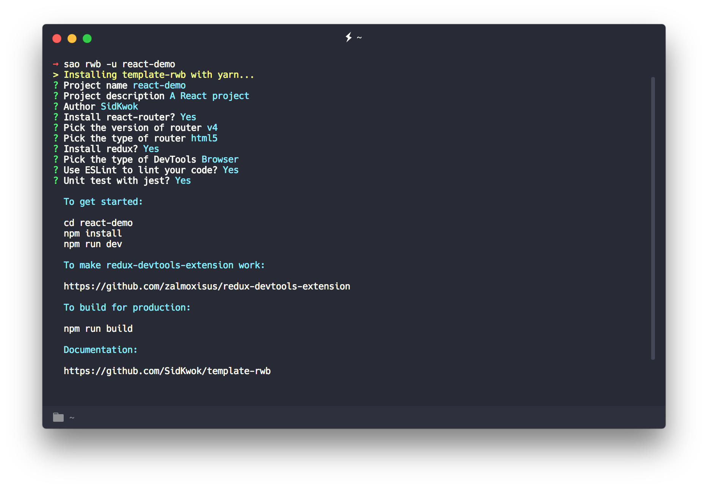

# react-webpack-boilerplate

> A SPA boilerplate with React, built with love.

<div align="center"></div>

## Features
 - **React 15.4.2**
 - **Redux 3.6.0**
 - **react-redux 5.0.2**, to bind React and Redux.
 - **react-router 3.0.2**, will be updated to v4 whenever the version is stable.
 - **JSX**
 - **ES6**
 - **webpack 2.2**
 - **Express**, the dev-server.
 - **Hot-Reload**, support both React and Redux!
 - **Proxy**
 - **Environmental value**
 - **ESlint**, with [`standard`](https://github.com/feross/standard/blob/master/RULES.md#javascript-standard-style) and [`standard-react`](https://github.com/feross/eslint-config-standard-react).
 - **Redux-devtools**, to make the stores more clear

## Usage

```bash
# install sao first
npm install -g sao

# download the template
sao SidKwok/react-webpack-boilerplate new-project --install

# install all this dependencies.
cd new-project
npm install

# development, default port: 8080
npm run dev

# production
npm run build

# lint the files (if use eslint)
npm run lint
```

## Doc

It is pretty much the same config as [vue-cli/webpack](https://github.com/vuejs-templates/webpack/tree/master/docs). If you are familiar with `vue-cli`, you may have a great joy with this boilerplate. If you want to have a peek of the structure, you can visit [`full-features` branch](https://github.com/SidKwok/react-webpack-boilerplate/tree/full-features).

### Pre-Processor

You can take `less`, `sass`, or `stylus` as your CSS pre-processors, after installing the dependencies. For example, to use `less`:
```bash
npm install less less-loader --save-dev
```
Then, you can `import` your `less` files in your components.

### Proxy

The boilerplate uses [http-proxy-middleware](https://github.com/chimurai/http-proxy-middleware)  for proxying.
For example, you want to proxy `/api/get-post` and `/api/get-id`, you can edit the option in `config/index.js`:
```javascript
...
dev: {
    proxyTable: {
        '/api': {
            target: 'http://example.org',
            changeOrigin: true
        }
    }
}
...
```
Then, you can proxy `/api` in your dev server. See more [options](https://github.com/chimurai/http-proxy-middleware#options).

### Env

This [doc](https://github.com/vuejs-templates/webpack/blob/master/docs/env.md) can illustrate the usage well.

### Hot-Reload

The boilerplate uses [react-hot-loader v3](https://github.com/gaearon/react-hot-loader/tree/next) to tweak React components, even for Redux! Have fun!

### ESlint

[standard](https://github.com/feross/standard) and [standard-react](https://github.com/feross/standard-react) are the default style guides for this boilerplate, feel free to edit your own config in `.eslintrc.js`.

### Redux

You can use **Redux** in the project when you enable the choice. Noted that we separate two kinds of store(`dev` and `prod`) in two files. The `prod` ones doesn't have any devtools' code, in order to reduce the size of bundle. If you need to apply the middleware (`redux-thunk`, `redux-saga` and so on), you need to apply them in two files (`configureStore.dev.js` and `configureStore.prod.js`) so that you can use the middlewares in two different environments.

### redux-devtools

This boilerplate has enabled the `browser devtool` config for **Redux** automatically. To make it work, you need to download the [extension](https://github.com/zalmoxisus/redux-devtools-extension) for your browser.

You can also choose `Customized DevTools` which is built in your page. With this you can customized you own devtool. Click [here](https://github.com/gaearon/redux-devtools) to see more options.

### Production

The production files are built for server, so you are not supposed to visit `index.html` directly. To make it works, you should use a static server:
```bash
npm install -g anywhere # or others

# in `./dist`
anywhere
```

## TODO

* [x] eslint
* [ ] unit test
* [ ] e2e test
* [x] **Redux** comming soon!
* [x] hot-reload for redux
* [ ] better structure for redux
* [x] support redux-devtools-extension
* [ ] use happypack to make building process fly!
* [x] Choices of DevTools: browser extension or customized DevTools component

## Known Issues

* When combine with `react-router`, hot-reload will cause browser's error log in `console`. This is `react-router v3`'s known issue, but it doesn't have other side effects. I solve this issue with a random number as a key in router, thanks[@chenz24](https://github.com/chenz24).

* ~~When combine with `Redux`, hot-reload will cause `<Provider> does not support changing `store` on the fly...` in the console, and break hot-reload in redux.~~
